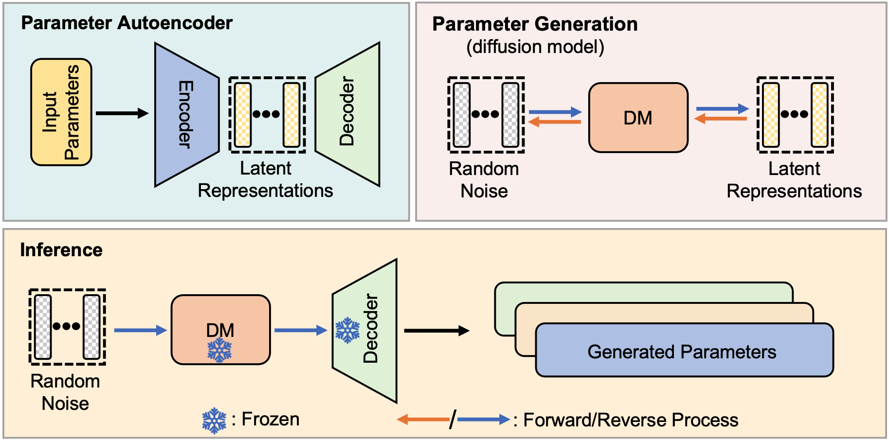

# Neural Network Diffusion

  
This repository contains the code and implementation details for the research paper titled **[Neural Network Diffusion](https://arxiv.org/abs/2402.13144)**. 
The paper explores novel paradigms in deep learning, specifically focusing on diffusion models for generating high-performing neural network parameters.


## Authors
- [Kai Wang](https://kaiwang960112.github.io/)<sup>1</sup>, 
[Dongwen Tang](https://scholar.google.com/citations?user=9lKm_5IAAAAJ&hl=zh-CN)<sup>1</sup>,
[Boya Zeng](https://boyazeng.github.io/)<sup>2</sup>,
[Yida Yin](https://davidyyd.github.io/)<sup>3</sup>,
[Zhaopan Xu](https://scholar.google.com.hk/citations?user=qNWDwOcAAAAJ&hl=zh-CN)<sup>1</sup>,
[Yukun Zhou](https://scholar.google.com/citations?user=c0WCD74AAAAJ&hl=zh-CN), 
[Zelin Zang](https://scholar.google.com/citations?user=foERjnQAAAAJ&hl=zh-CN)<sup>1</sup>, 
[Trevor Darrell](https://people.eecs.berkeley.edu/~trevor/)<sup>3</sup>, 
[Zhuang Liu*](https://liuzhuang13.github.io/)<sup>4</sup>, 
and [Yang You*](https://www.comp.nus.edu.sg/~youy/)<sup>1</sup>(* equal advising)  
- <sup>1</sup>[National University of Singapore](https://www.nus.edu.sg/),
  <sup>2</sup>[University of Pennsylvania](https://www.upenn.edu/),
<sup>3</sup>[University of California, Berkeley](https://www.berkeley.edu/),
and <sup>4</sup>[Meta AI](https://www.meta.com/)


## Overview

<p align="center">

<figcaption>
Figure: Our approach consists of two processes: parameter autoencoder and parameter generation. Parameter autoencoder aims to extract the latent representations and reconstruct model parameters via the decoder.
The extracted representations are used to train a diffusion model (DM).
During inference, a random noise vector is fed into the DM and the trained decoder to generate new parameters.
</figcaption>
</p>

> **Abstract:** Diffusion models have achieved remarkable success in image and video generation. In this work, we demonstrate that diffusion models can also generate high-performing neural network parameters.
Our approach is simple, utilizing an autoencoder and a diffusion model. The autoencoder extracts latent representations of a subset of the trained neural network parameters. Next, a diffusion model is trained to synthesize these latent representations from random noise. This model then generates new representations, which are passed through the autoencoder's decoder to produce new subsets of high-performing network parameters. Across various architectures and datasets, our approach consistently generates models with comparable or improved performance over trained networks, with minimal additional cost. Notably, we empirically find that the generated models are not memorizing the trained ones. Our results encourage more exploration into the versatile use of diffusion models.


## Environment
We support all versions of `pytorch>=2.0.0`.
But we recommend to use `python==3.11` and `pytorch==2.5.1`, which we have fully tested.
```shell
conda create -n pdiff python=3.11
conda activate pdiff
conda install pytorch torchvision torchaudio pytorch-cuda=12.1 -c pytorch -c nvidia
git clone https://github.com/NUS-HPC-AI-Lab/Neural-Network-Diffusion.git --depth=1
cd Neural-Network-Diffusion
pip install -r requirements.txt
```


## Quick Start

This will run three steps sequentially: preparing the dataset, training p-diff, and evaluating.
Then the results will be saved in the root directory and save checkpoint in `./checkpoint`
```shell
cd workspace
bash run_all.sh main cifar100_resnet18 0
# bash run_all <category> <tag> <device>
```

## Detailed Usage

Prepare checkpoints dataset.
```shell
cd ./dataset/main/cifar100_resnet18
rm performance.cache  # optional
CUDA_VISIBLE_DEVICES=0 python train.py
CUDA_VISIBLE_DEVICES=0 python finetune.py
```
Train pdiff and generate models.
```shell
cd ../../../workspace
bash launch.sh main cifar100_resnet18 0
# bash launch <category> <tag> <device>
CUDA_VISIBLE_DEVICES=0 python generate.py main cifar100_resnet18
# CUDA_VISIBLE_DEVICES=<device> python generate.py <category> <tag>
```
Test original checkpoints and generated checkpoints and their similarity.
```shell
CUDA_VISIBLE_DEVICES=0 python evaluate.py main cifar100_resnet18
# CUDA_VISIBLE_DEVICES=<device> python evaluate.py <category> <tag>
```

All our `<category>` and `<tag>` can be found in `./dataset/<category>/<tag>`.


## Register Your Own Dataset

1. Create a directory that mimics the dataset folder and contains three contents:  
```shell
mkdir ./dataset/main/<tag>
cd ./dataset/main/<tag>
```
`checkpoint`: A directory contains many `.pth` files, which contain dictionaries of parameters.  
`generated`: An empty directory, where the generated model will be stored.  
`test.py`: A test script to test the checkpoints. It should be callable as follows:  
```shell
CUDA_VISIBLE_DEVICES=0 python test.py ./checkpoint/checkpoint001.pth
# CUDA_VISIBLE_DEVICES=<device> python test.py <checkpoint_file>
```

2. Register a dataset.  
Add a class to the last line of the dataset file.
```shell
cd ../../../dataset
vim __init__.py  
# This __init__.py is the dataset file.
```
```diff
# on line 392
+ class <Tag>(MainDataset): pass
```

3. Create your launch script.  
You can change other hyperparameters here.
```shell
cd ../workspace/main
cp cifar10_resnet18.py main_<tag>.py
vim main_<tag>.py
```
```diff
# on line 33
- from dataset import Cifar100_ResNet18 as Dataset
+ from dataset import <Tag> as Dataset
```

4. Train pdiff and generate models.  
Following Section "Detail Usage".  


5. Test original ckpt and generated ckpt and their similarity.  
Following Section "Detail Usage".  


## Acknowledgments
We thank [Kaiming He](https://kaiminghe.github.io/), 
[Dianbo Liu](https://www.cogai4sci.com/), 
[Mingjia Shi](https://scholar.google.com/citations?user=B6f3ImkAAAAJ&hl=en), 
[Zheng Zhu](https://scholar.google.com/citations?user=NmwjI0AAAAAJ&hl=en), 
[Bo Zhao](https://www.bozhao.me/), 
[Jiawei Liu](https://jia-wei-liu.github.io/), 
[Yong Liu](https://ai.comp.nus.edu.sg/people/yong/), 
[Ziheng Qin](https://scholar.google.com/citations?user=I04VhPMAAAAJ&hl=zh-CN), 
[Zangwei Zheng](https://zhengzangw.github.io/), 
[Yifan Zhang](https://sites.google.com/view/yifan-zhang/%E9%A6%96%E9%A1%B5), 
[Xiangyu Peng](https://scholar.google.com/citations?user=KRUTk7sAAAAJ&hl=zh-CN), 
[Hongyan Chang](https://www.comp.nus.edu.sg/~hongyan/), 
[Zirui Zhu](https://zirui-zhu.com/), 
[Dave Zhenyu Chen](https://daveredrum.github.io/), 
[Ahmad Sajedi](https://ahmadsajedii.github.io/) 
and [George Cazenavette](https://georgecazenavette.github.io/) 
for valuable discussions and feedbacks.


## Citation
If you found our work useful, please consider citing us.

```
@misc{wang2024neural,
      title={Neural Network Diffusion}, 
      author={Kai Wang and Dongwen Tang and Boya Zeng and Yida Yin and Zhaopan Xu and Yukun Zhou and Zelin Zang and Trevor Darrell and Zhuang Liu and Yang You},
      year={2024},
      eprint={2402.13144},
      archivePrefix={arXiv},
      primaryClass={cs.LG}
}
```
