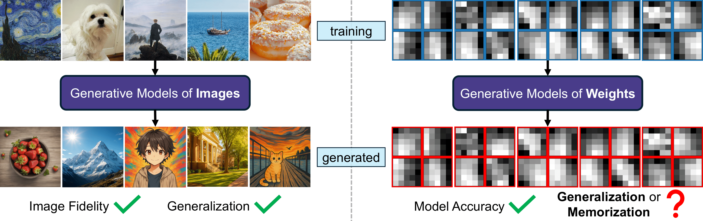

# Generative Modeling of Weights: Generalization or Memorization?

Official code for **Generative Modeling of Weights: Generalization or Memorization?**

> [**Generative Modeling of Weights: Generalization or Memorization?**](https://arxiv.org/abs/2506.07998)<br>
> [Boya Zeng](https://boyazeng.github.io), [Yida Yin](https://davidyyd.github.io), [Zhiqiu Xu](https://oscarxzq.github.io/), [Zhuang Liu](https://www.cs.princeton.edu/~zhuangl)
> <br>Princeton University, University of Pennsylvania<br>
> [[`arXiv`](https://arxiv.org/abs/2506.07998)][[`video`](https://www.youtube.com/watch?v=3OGGjh4fPwA)][[`project page`](https://boyazeng.github.io/weight_memorization/)]

<p align="center">

</p>

We find that current generative modeling methods for neural network weights synthesize weights largely by memorization: they produce either replicas, or at best simple interpolations, of the training checkpoints. They also fail to outperform simple baselines, such as adding noise to the weights or taking a simple weight ensemble, in obtaining different and simultaneously high-performing models.

## Code Structure

Each folder evaluates one of the following four generative modeling methods for neural network weights.

1. [Hyper-Representations](https://arxiv.org/abs/2209.14733)
2. [G.pt](https://arxiv.org/abs/2209.12892)
3. [HyperDiffusion](https://arxiv.org/abs/2303.17015)
4. [P-diff](https://arxiv.org/abs/2402.13144)

The contents of each folder are as follows:

* ``method`` contains the source code of each method.
* ``evaluation`` contains the code for sampling and evaluating new model weights.
* ``data`` will store the training, generated, and baseline weights, and their evaluation data.
* ``*.py`` are standalone files for generating different figures in the paper.
* ``figures`` will store the generated figures.
* ``README.md`` provides instructions to run the full evaluation pipeline.
* ``modifications.md`` documents the minimal changes made to the source code of each method.

## Installation
Please follow the instructions in the ``README.md`` file of each folder to set up the environment for evaluating each method.

## Acknowledgement
This repository is built using the [Hyper-Representations](https://github.com/HSG-AIML/NeurIPS_2022-Generative_Hyper_Representations), [G.pt](https://github.com/wpeebles/G.pt), [HyperDiffusion](https://github.com/Rgtemze/HyperDiffusion), and [P-diff](https://github.com/NUS-HPC-AI-Lab/Neural-Network-Diffusion) codebases.

## Citation
If you find this repository helpful, please consider citing:
```bibtex
@article{zeng2025generative,
  title={Generative Modeling of Weights: Generalization or Memorization?},
  author={Boya Zeng and Yida Yin and Zhiqiu Xu and Zhuang Liu},
  journal={arXiv preprint arXiv:2506.07998},
  year={2025},
}
```